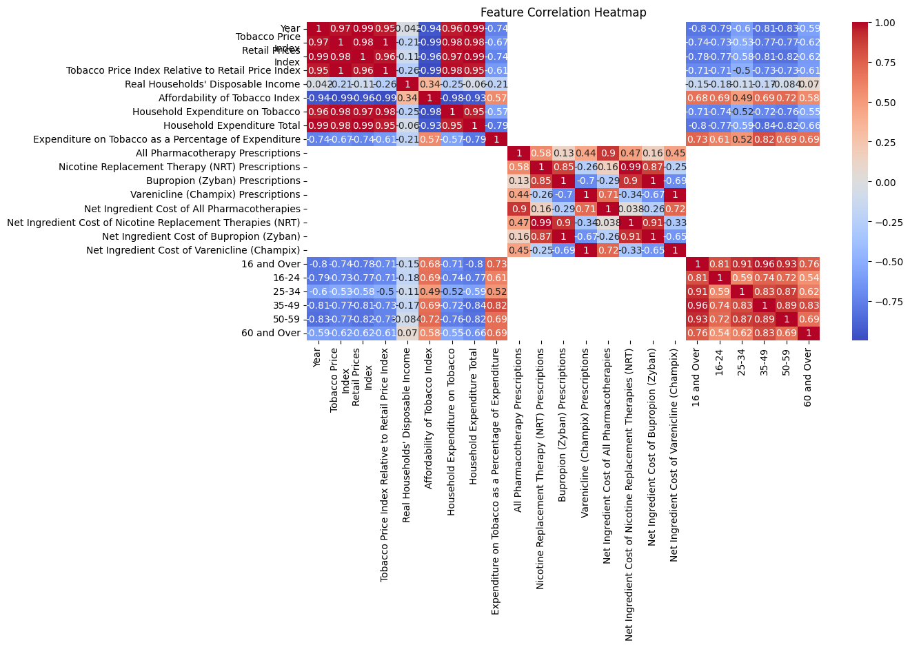

# 🚬 Tobacco Use & Mortality Prediction 🏥  

This project analyzes the relationship between tobacco use and mortality rates using **Machine Learning**.  
It predicts mortality based on various factors like smoking prevalence, tobacco pricing, and demographic data.
[Live App](https://tobacco-mortality-prediction.streamlit.app/)  

---

## 📌 Features  
✅ Predict mortality based on tobacco-related data  
✅ Interactive **Streamlit Web App** for user input  
✅ **Data Preprocessing & Cleaning** for high accuracy  
✅ **Machine Learning Model** trained on real-world data  
✅ **Exploratory Data Analysis (EDA) with Visualizations**  
✅ **Automatic PDF Report Generation with Graphs**  

---

## 📂 Project Structure  
```
📁 Tobacco Mortality Prediction  
│-- 📜 README.md  
│-- 📜 app.py  # Streamlit UI  
│-- 📜 model_training.ipynb  # Jupyter Notebook for ML  
│-- 📜 mortality_model.pkl  # Trained ML Model  
│-- 📜 label_encoders.pkl  # Encoded Categorical Data  
│-- 📜 Tobacco_Mortality_Report.pdf  # Generated Report  
│-- 📜 requirements.txt  # Dependencies  
│-- 📁 data  
│   │-- admissions.csv  
│   │-- fatalities.csv  
│   │-- metrics.csv  
│   │-- prescriptions.csv  
│   │-- smokers.csv  
```

---

## 🚀 **Setup & Installation**  
### **🔹 1. Clone the Repository**  
```bash
git clone https://github.com/your-username/tobacco-mortality-prediction.git
cd tobacco-mortality-prediction
```

### **🔹 2. Install Required Dependencies**  
```bash
pip install -r requirements.txt
```

### **🔹 3. Run the Streamlit App**  
```bash
streamlit run app.py
```

---

## 📊 **Exploratory Data Analysis (EDA)**
### **🔹 Data Visualization**
  
📌 **Correlation heatmap to understand feature relationships.**  

---

## 🤖 **Machine Learning Model**
- **Model Used:** `RandomForestRegressor`
- **Performance Metrics:(For this project)**
  - **MAE:** `100.66`
  - **MSE:** `138934.15`
  - **R² Score:** `0.9998`
  
```python
# Model Training Code
from sklearn.ensemble import RandomForestRegressor

model = RandomForestRegressor(n_estimators=100, random_state=42)
model.fit(X_train, y_train)
joblib.dump(model, "mortality_model.pkl")
```

---

## 📜 **Generated PDF Report**
The project automatically generates a detailed PDF report with **graphs and insights**.  
To generate the report, run:  
```bash
python generate_report.py
```
📌 **Check `Tobacco_Mortality_Report.pdf` for detailed analysis.**

---

## ⚡ **Future Improvements**
✅ Improve model accuracy with hyperparameter tuning  
✅ Add more advanced ML models like **XGBoost, LSTM** 

---

## 🤝 **Contributions**
Want to contribute? Follow these steps:
1. **Fork the Repository**  
2. **Create a Feature Branch:** `git checkout -b feature-name`  
3. **Commit Changes & Push:** `git push origin feature-name`  
4. **Create a Pull Request (PR)**  

---

## 📧 **Contact & Support**
🔗 **GitHub:** [imabhnv](https://github.com/imabhnv)  
📩 **Email:** varshneyabhinav66@gmail.com  

📌 **Star ⭐ the repo if you found this useful!** 🚀  
